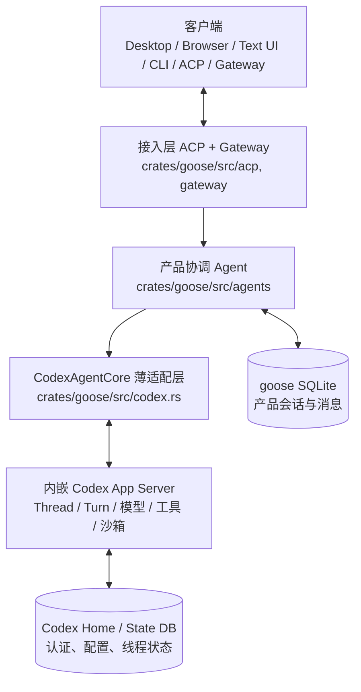
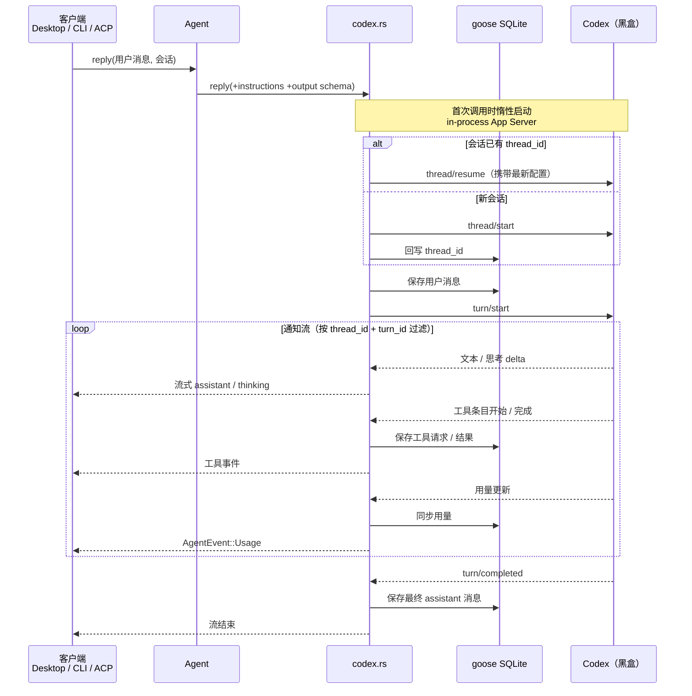
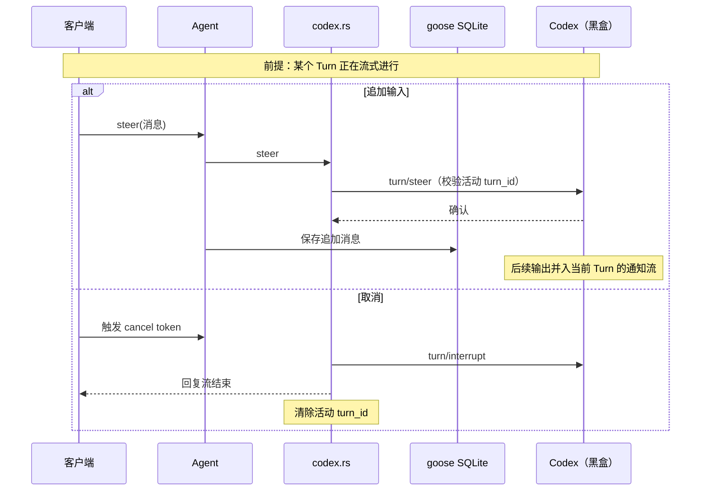
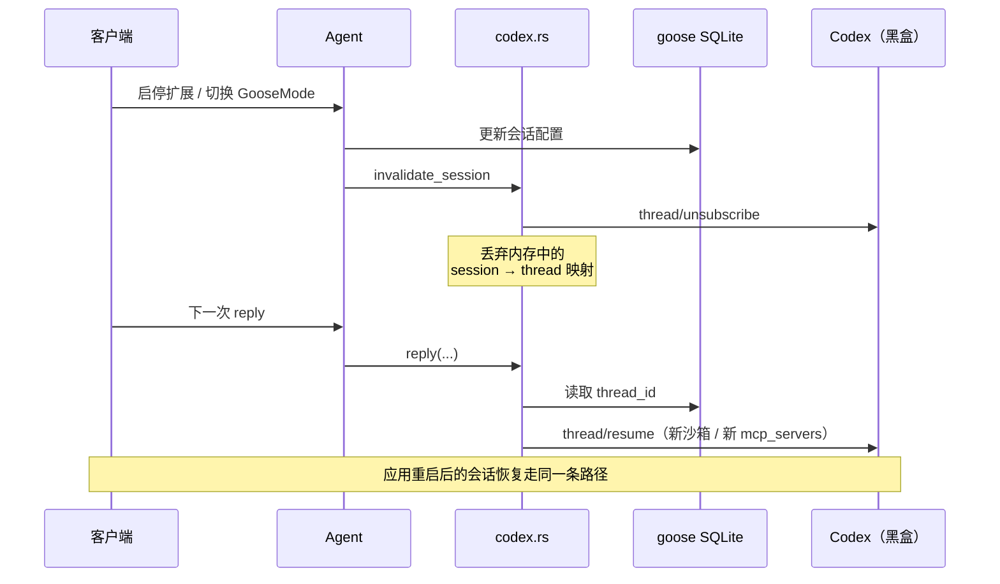

# goose 系统架构

## 一句话定位

goose 负责产品壳（UI、接入、会话、Recipe、扩展选择），Agent Runtime 完全复用 Codex。`crates/goose/src/codex.rs` 是两者之间唯一的薄适配层，goose 不再自己实现 Agent 循环。

Codex 以 Rust 依赖嵌入 goose 进程，通过 `codex-app-server-client` 的 in-process transport 调用，不启动子进程。



## 模块职责

| 层次 | 位置 | 职责 |
| --- | --- | --- |
| 客户端 | `ui/desktop`、`ui/text`、`crates/goose-cli` | 交互、请求发起、流式展示；Electron 与浏览器共用同一 React renderer |
| 接入层 | `crates/goose/src/acp`、`gateway` | ACP / CLI / 外部消息入口，绑定 goose 会话 |
| 产品协调 | `crates/goose/src/agents` | Prompt、Recipe、扩展、输出 Schema、`AgentEvent` 接口 |
| Codex 适配 | `crates/goose/src/codex.rs` | Runtime 生命周期、Thread 映射、请求/事件转换、用量同步、中断 |
| Codex Runtime | `codex-*` 依赖 | Agent 循环、认证配置、模型、上下文、工具执行、沙箱、线程状态 |
| Provider 兼容 | `crates/goose/src/providers` 等 | 元数据与辅助调用（如会话命名）；不承载主对话循环 |
| 扩展 | `crates/goose-mcp`、`agents/extension_*` | 管理 goose 扩展，投影为 Codex 的 `mcp_servers` 配置 |

## 主请求链路

下列时序图把 Codex 视为黑盒：goose 只关心发出的协议请求（`thread/*`、`turn/*`）和收到的通知流，不关心其内部的模型调用与工具执行。

### 一次完整回复



### Turn 进行中的控制



### 配置变更与会话续接



### 压缩与清空

- `/compact` 不再调用 goose Provider 生成摘要，而是直接发 `thread/compact/start`，等待 Codex 的 compaction Turn 完成并同步用量。
- 清空会话时先 `thread/unsubscribe`，删除 `extension_data.codex.thread_id`，再清空 goose 展示消息；下一次回复会创建全新的 Codex Thread，旧上下文不会残留。
- goose SQLite 保留完整产品展示记录直至用户清空；模型上下文的压缩表示只由 Codex rollout/state 管理。

## codex.rs 接口与实现

### 对外接口

| 接口 | 调用方 | 作用 |
| --- | --- | --- |
| `codex::run(main_fn)` | `goose-cli` main | 进程入口包装：调用 `codex_core_api::arg0_dispatch_or_else` 处理 arg0 分发（sandbox 辅助进程复用同一 binary），并保存 `Arg0DispatchPaths` 供 Runtime 启动使用 |
| `CodexAgentCore::new(runtime)` | `Agent::with_config` | 每个 Agent 持有一个实例；`Arc<OnceCell<CodexRuntime>>` 来自 `AgentConfig`，因此多个 Agent 共享同一 Runtime |
| `reply(...)` | `Agent::reply` | 发起一个 Turn，返回 `BoxStream<AgentEvent>`；入参含用户消息、instructions、output schema 和取消 token |
| `steer(session_id, message)` | `Agent::steer` | 当前有活动 Turn 时追加输入（`turn/steer`），返回是否已投递 |
| `compact(...)` | CLI / ACP `/compact` | 调用 `thread/compact/start` 并等待原生压缩 Turn 完成 |
| `invalidate_session(session)` | 扩展或 GooseMode 变更时 | `thread/unsubscribe` 并丢弃内存映射，下次 reply 会用新配置 `thread/resume` |
| `reset_session(...)` | 清空会话 | unsubscribe 后删除持久化的 `thread_id`，保证下一次创建新 Thread |

### CodexRuntime（进程级单例）

首次 `reply` 时经 `OnceCell::get_or_try_init` 惰性创建，之后所有会话共享：

1. `set_default_originator("goose")`，用 Codex 自己的加载器读取配置（`Config::load_with_cli_overrides`），注入 arg0 路径。
2. 初始化 Codex State DB 与 `EnvironmentManager`，然后 `InProcessAppServerClient::start(...)` 在进程内启动 App Server（`session_source`、`client_name` 均标记为 goose）。
3. 启动一个后台事件路由任务，把 `InProcessServerEvent` 分发到 `broadcast` channel：
   - `ServerNotification` → 原样广播，由各回复流自行过滤；
   - `ServerRequest`（交互式审批等）→ 直接以 JSON-RPC error 拒绝（goose 未接入审批 UI，安全靠沙箱模式）；
   - `Lagged` / 断连 → 广播为传输错误，使进行中的 Turn 以错误结束。
4. `Drop` 时通过 `CancellationToken` 停止路由任务并关闭 client。

所有请求用进程级 `AtomicI64` 生成唯一 JSON-RPC `RequestId`（与 codex 自家 exec/TUI 的做法一致）。

### reply 的执行流程

1. **会话 → 线程映射**：查内存 `threads: HashMap<session_id, ActiveThread>`；未命中时按 `extension_data.codex.thread_id` 决定 `thread/resume`（带 `exclude_turns: true`，不回放历史）或 `thread/start`，并把新 `thread_id` 写回 session。两次加锁间做 double-check 防并发重复建线程。
2. **构造线程配置**：`working_dir` → `cwd` / `runtime_workspace_roots`；`GooseMode` → `SandboxMode`；启用的扩展（Stdio / StreamableHttp）转换为 `mcp_servers` TOML override 传给 Codex 的 MCP 客户端。
3. **发起 Turn**：先订阅 broadcast（保证不漏事件），保存用户消息，再 `turn/start`（携带 output schema），记录活动 `turn_id`。
4. **事件循环**（`async_stream` 生成 `AgentEvent` 流）：只处理 `thread_id` + `turn_id` 匹配的通知；`tokio::select!` 同时监听取消 token，取消时发 `turn/interrupt` 退出。文本 delta 直接流式转发；`ItemStarted` / `ItemCompleted` 转换为工具请求 / 结果消息并落库；用量事件同步到 session 并产出 `AgentEvent::Usage`；`TurnCompleted` 时若从未流式输出过文本则补发最终 assistant 消息，随后按状态正常结束或报错。

### 消息与工具事件转换

- goose `Message` → Codex `UserInput`：仅转换 Text 与 Image（data URL），其余内容忽略。
- Codex `ThreadItem` → goose 工具消息：`CommandExecution` / `FileChange`(apply_patch) / `McpToolCall`(`server__tool`) / `WebSearch` / `ImageView` / `ImageGeneration`；均标记 `TOOL_META_EXTERNAL_DISPATCH_KEY`，告知 UI 这些工具由 Codex 执行、goose 不会二次调度。
- 命令类条目按 `CommandAction` 全为同类时映射为 `list_files` / `read_files` / `search_files`，否则归为 `shell`（仅影响展示名）。

## 配置与权限映射

创建 / 恢复 Thread 时，goose 会话配置转换为 App Server 参数：

| goose 输入 | Codex 参数 |
| --- | --- |
| `working_dir` | `cwd` + `runtime_workspace_roots` |
| 显式模型（非 `current`） | `model`，否则由 Codex 选默认值 |
| `PromptManager` | `base_instructions` / `developer_instructions` |
| Recipe `response.json_schema` | `turn/start.output_schema` |
| 已启用扩展 | `mcp_servers` override |
| `GOOSE_AUTO_COMPACT_THRESHOLD` + 模型 context limit | Codex `model_auto_compact_token_limit` |
| `GooseMode` | `SandboxMode`（见下表） |

| GooseMode | Codex SandboxMode |
| --- | --- |
| `Auto` | `DangerFullAccess` |
| `SmartApprove` | `WorkspaceWrite` |
| `Approve` / `Chat` | `ReadOnly` |

Thread 固定使用 `AskForApproval::Never`：goose 未接入 Codex 交互式审批请求，收到会直接拒绝；安全边界由沙箱模式提供。goose 侧旧的工具审批与安全检查子系统（inspectors、frontend tools、confirmation 循环）已随迁移删除。

## 状态所有权

| 状态 | 所有者 | 位置 |
| --- | --- | --- |
| 会话元数据、展示消息、用量 | goose | goose SQLite |
| Codex 关联键（仅 `thread_id`） | goose | Session `extension_data.codex` |
| 进程内活动状态（模型、活动 `turn_id`） | 适配层 | 内存 `session_id → ActiveThread` |
| Thread / Turn / rollout / 上下文 / 认证 | Codex | Codex Home / State DB |

恢复会话 = 读取 `thread_id` + `thread/resume`；goose 不复制 Codex 的上下文或线程存储。

## 事件语义映射

| Codex notification | goose 输出 |
| --- | --- |
| `AgentMessageDelta` | 流式 assistant 文本 |
| `Reasoning*TextDelta` | thinking 消息 |
| `ItemStarted` / `ItemCompleted` | 工具请求 / 结果消息 |
| `ThreadTokenUsageUpdated` | 会话用量与 `AgentEvent::Usage` |
| `Warning` / 非重试 `Error` | 系统提示 / 流错误 |
| `TurnCompleted` | 最终 assistant 消息与回合状态 |

命令类工具按 `CommandAction` 映射为 `list_files` / `read_files` / `search_files` / `shell`，仅影响 UI 展示名称。

## 演进原则

- 新的 Codex 能力优先通过 App Server protocol 暴露，`codex.rs` 只做最小事件适配，不在 goose 中重新实现。
- UI 依赖 goose `Message` / `AgentEvent` 或 ACP 类型，不直接绑定 Codex protocol 类型。
- `providers/codex.rs` 仅是元数据壳；`chatgpt_codex`、`codex_acp`、`FinalOutputTool` 及旧的工具调度 / 审批 / 安全检查模块均已删除。

## Desktop / Browser 共享前端

Electron 与浏览器共用 `index.html`、React renderer、ACP SDK 和全部样式，仅在宿主能力注入处分支：`renderer-bootstrap.ts` 检测 `window.electron`，存在则用 Electron preload，否则安装 `browserHost.ts`（同一 `ElectronAPI` 接口的浏览器实现，Electron 专属能力显式降级）。

| 能力 | Electron | BrowserHost |
| --- | --- | --- |
| ACP 地址与 token | preload / 主进程配置 | URL 参数或 `VITE_GOOSE_*` |
| 设置与本地记录 | Electron 持久化 | `localStorage` |
| 文件访问 | 原生对话框、任意路径 | 仅用户选择的文件；任意路径读写不支持 |
| 通知 / 外链 | Electron 原生 | Web Notification / `window.open` |
| Dock、自动更新等 | 支持 | 不支持 |

Shell、文件和工具能力始终在 `goose serve` / Codex Runtime 中执行，不下放到浏览器。样式必须由 `renderer.tsx` 模块导入（Vite 要求）；生产 CSP 不含 `unsafe-eval`，仅开发服务器临时放开。

## 浏览器开发入口

```bash
./scripts/start-web.sh   # 或 just run-web
```

脚本构建 release binary，生成随机 `SERVER_SECRET`，在 `127.0.0.1:3284` 启动 `goose serve`（校验 token 与 Origin），再在 `127.0.0.1:5173` 启动 Vite 加载共享 renderer，通过 `ws://127.0.0.1:3284/acp` 连接。端口由 `GOOSE_WEB_PORT` / `GOOSE_SERVER_PORT` 覆盖，固定 token 用 `GOOSE_SERVER__SECRET_KEY`。前后端均只监听 loopback，定位为本机开发调试。
