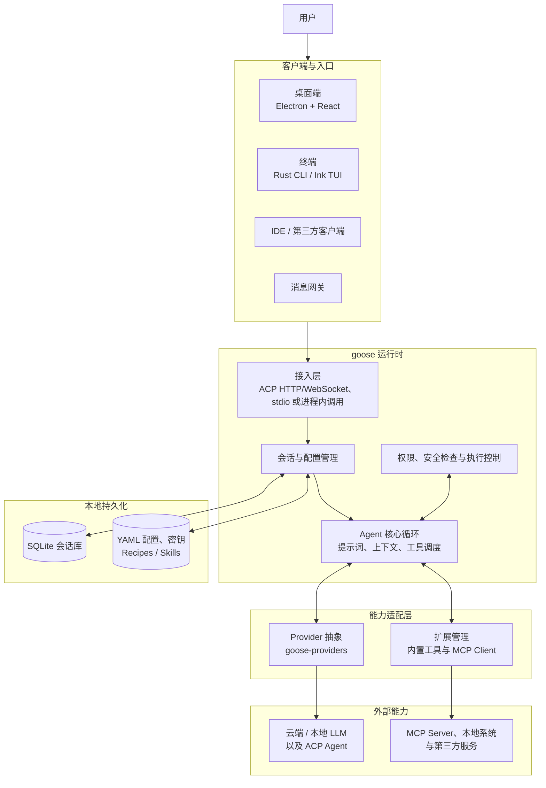

# goose 系统整体架构

goose 采用“多客户端 + 统一 Agent 核心 + 可插拔模型与工具”的分层架构。ACP 是桌面端、终端 UI 和第三方客户端接入核心能力的主要协议；传统 Rust CLI 也可以直接调用核心模块。

## 核心模块对应关系

| 层次 | 主要目录 / crate | 职责 |
| --- | --- | --- |
| 客户端 | `ui/desktop`、`ui/text`、`crates/goose-cli` | 用户交互、启动或连接 goose 运行时 |
| 接入与核心 | `crates/goose/src/acp`、`crates/goose/src/agents` | ACP 接入、会话驱动、Agent 循环和工具调度 |
| 模型适配 | `crates/goose-providers`、`crates/goose-provider-types` | 统一不同云端、本地模型和 ACP Provider |
| 工具扩展 | `crates/goose-mcp`、外部 MCP Server | 向 Agent 提供文件、命令及第三方系统能力 |
| 状态与配置 | `crates/goose/src/session`、`crates/goose/src/config` | 保存会话、配置、权限和工作流定义 |

典型请求会在 Agent 核心中循环执行：模型生成回复或工具调用，goose 完成权限检查并调度工具，再把结果送回模型，直到得到最终答复。
