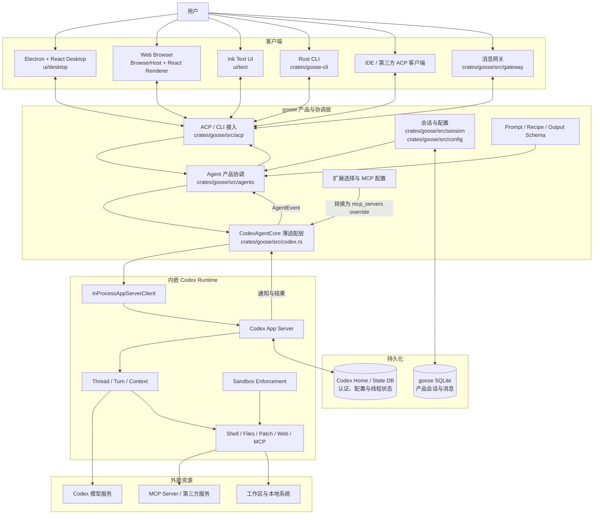
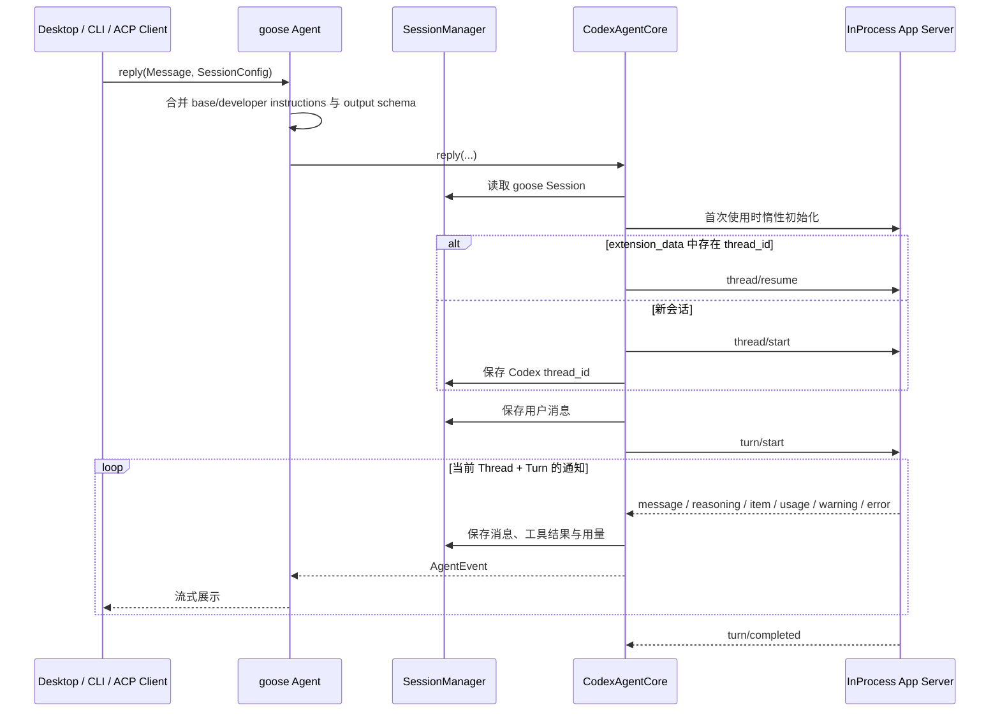

# goose 系统架构

## 架构定位

goose 当前采用“产品壳与接入层由 goose 负责，Agent Runtime 复用 Codex”的架构。

- goose 聚焦 Electron / Browser / CLI 用户体验、ACP 接入、产品会话、Recipes、扩展选择和事件展示。
- Codex App Server 负责线程与 Turn、模型交互、上下文管理、工具执行、沙箱和运行时状态。
- `crates/goose/src/codex.rs` 是两者之间的薄适配层，不再自行实现一套 Agent 循环。

Codex 以 Rust 依赖嵌入 goose 进程，通过 `codex-app-server-client` 的 in-process transport 调用。主对话路径不启动 `codex exec` 子进程，也不经过外部 `codex-acp` 进程。



## 模块与职责

| 层次 | 主要位置 | 当前职责 |
| --- | --- | --- |
| 客户端 | `ui/desktop`、`ui/text`、`crates/goose-cli` | Electron 与浏览器共用 React renderer；负责交互、进程启动、请求发起和流式结果展示 |
| 接入层 | `crates/goose/src/acp`、`crates/goose/src/gateway` | ACP、CLI 和外部消息入口，将请求绑定到 goose 会话 |
| 产品协调层 | `crates/goose/src/agents` | Prompt、Recipe、扩展、输出 Schema、会话操作和 `AgentEvent` 接口 |
| Codex 适配层 | `crates/goose/src/codex.rs` | App Server 生命周期、Thread 映射、请求转换、事件转换、用量同步和中断控制 |
| Codex Runtime | `codex-app-server-client`、`codex-app-server-protocol`、`codex-core-api`、`codex-config` | 原生 Agent 循环、认证与配置、模型、上下文、工具、沙箱和线程状态 |
| Provider 兼容层 | `crates/goose/src/providers`、`crates/goose-providers`、`crates/goose-provider-types` | Provider 元数据、配置兼容和少量辅助调用；不承载 Codex 主对话循环 |
| 扩展层 | `crates/goose-mcp`、`crates/goose/src/agents/extension_*` | 管理 goose 扩展，并将启用的 MCP Server 投影到 Codex Thread 配置 |
| 持久化 | `crates/goose/src/session`、Codex Home / State DB | 分别保存产品会话与 Codex 原生线程状态 |

## 主请求链路



`CodexRuntime` 在首次请求时通过 `OnceCell` 初始化。后台事件路由器消费 `InProcessServerEvent`，再通过 broadcast channel 分发；每个回复流只处理与自身 `thread_id` 和 `turn_id` 匹配的通知，避免并发会话串流。

除普通回复外，适配层还直接映射以下生命周期操作：

- 用户追加输入：`turn/steer`
- 用户取消：`turn/interrupt`
- 会话失效或切换：`thread/unsubscribe`
- 应用重启后继续会话：`thread/resume`

所有 App Server 请求都携带唯一 JSON-RPC `RequestId`。

## 职责边界

### goose 拥有

- Desktop、Web Browser、Text UI、CLI 和 ACP 产品接口
- 产品会话元数据、展示消息和累计用量
- 工作目录、GooseMode、Recipe、Prompt 扩展和最终输出 Schema
- 启用哪些 goose 扩展，以及如何把扩展配置转换成 Codex MCP 配置
- 将 Codex 通知转换为现有 `Message` / `AgentEvent`，保持 UI 协议稳定

### Codex 拥有

- ChatGPT / API Key 认证和 Codex 配置加载
- 模型默认值、Thread / Turn 生命周期与上下文管理
- 模型调用、重试和原生工具循环
- Shell、文件读取、搜索、补丁、Web、图片及 MCP 工具执行
- 沙箱实际执行与 Codex State DB / Thread 状态

### 薄适配层拥有

- `goose session id ↔ Codex thread id` 映射
- goose `Message` 与 Codex `UserInput` 的转换
- App Server notification 与 goose 消息、工具事件、用量的转换
- Codex Runtime 的惰性启动、事件路由、取消、续接与清理

适配层不解析 Codex CLI JSONL、不创建临时 `codex exec` 进程，也不复制 Codex 的认证、Thread 存储或工具执行逻辑。

## 配置与权限映射

创建或恢复 Thread 时，goose 将产品会话中的动态配置作为 App Server 参数传入：

| goose 输入 | Codex 参数 / 行为 |
| --- | --- |
| `working_dir` | `cwd`，同时作为 `runtime_workspace_roots` |
| 显式模型 | `model`；模型名为 `current` 或未指定时交给 Codex 选择默认值 |
| `PromptManager` | `base_instructions` 和 `developer_instructions` |
| Final Output Tool | `turn/start.output_schema` |
| 已启用扩展 | Thread config 中的 `mcp_servers` override |
| `GooseMode` | `SandboxMode`，由 Codex 执行沙箱限制 |

当前模式映射如下：

| GooseMode | Codex SandboxMode |
| --- | --- |
| `Auto` | `DangerFullAccess` |
| `SmartApprove` | `WorkspaceWrite` |
| `Approve` | `ReadOnly` |
| `Chat` | `ReadOnly` |

当前 Thread 使用 `AskForApproval::Never`。goose 尚未把 Codex 的交互式 server request 接入现有审批 UI，因此运行时收到此类请求会明确拒绝；安全边界由启动 Turn 前选定的沙箱模式提供。

Codex Runtime 使用 Codex 自身的配置加载器和 Codex Home。Goose CLI 会把会话 provider 规范化为 `codex`；其他 `--provider` 值当前会提示被忽略。`codex` provider 文件仅保留目录展示和兼容所需的元数据壳，主对话始终进入 `CodexAgentCore`。

## 状态所有权

goose 与 Codex 各自保存自己负责的状态，通过最小引用关联，避免双写完整运行时状态。

| 状态 | 所有者 | 存储位置 |
| --- | --- | --- |
| 会话名称、工作目录、Recipe、GooseMode | goose | goose SQLite |
| UI 展示消息、工具事件、用量 | goose | goose SQLite |
| Codex 关联键 | goose | Session `extension_data.codex`，仅保存 `thread_id` |
| 当前进程活动状态 | goose 适配层 | 内存中的 `session_id → ActiveThread`，包含模型和活动 `turn_id` |
| 原生 Thread、Turn、rollout 和上下文 | Codex | Codex Home / State DB |
| 认证与 Codex 全局配置 | Codex | Codex Home 及受支持的环境配置 |

恢复会话时，goose 从 `extension_data` 读取 `thread_id` 并调用 `thread/resume`。goose 不保存 Codex rollout 路径，也不重建 Codex 上下文。

## 事件语义适配

Codex 负责实际执行，goose 只为现有 UI 恢复语义化展示：

| Codex notification / item | goose 输出 |
| --- | --- |
| `AgentMessageDelta` | 流式 assistant 文本 |
| `ReasoningSummaryTextDelta` / `ReasoningTextDelta` | thinking 消息 |
| `ItemStarted` | 工具请求消息 |
| `ItemCompleted` | 工具结果消息 |
| `ThreadTokenUsageUpdated` | 会话用量与 `AgentEvent::Usage` |
| `Warning` / 非重试 `Error` | 系统提示或流错误 |
| `TurnCompleted` | 最终 assistant 消息与 Turn 状态 |

命令类工具会依据 Codex `CommandAction` 映射为 `list_files`、`read_files`、`search_files` 或通用 `shell`。这个映射只影响 UI 展示名称，命令仍由 Codex Runtime 执行。

## 兼容层与演进原则

- `chatgpt_codex` 的独立 OAuth / API 实现和 `codex_acp` 外部进程实现已经删除。
- `crates/goose/src/providers/codex.rs` 仅保留 provider identity、模型占位和会话标题辅助逻辑。
- 其他 Provider、旧工具调度和审批相关模块仍可能被非主路径或兼容接口引用；删除前应先从调用链确认，而不是仅凭模块名称判断。
- 新的 Codex 能力优先通过 App Server protocol 暴露，再在 `codex.rs` 中做最小事件适配，避免在 goose 中重新实现。
- UI 应依赖 goose 的 `Message` / `AgentEvent` 或 ACP 类型，不直接绑定 Codex protocol 类型，从而允许 Runtime 升级而不扩散到界面层。

## 浏览器开发入口

浏览器与 Electron 共用 `index.html`、React renderer、路由、ACP SDK 和所有聊天组件。`renderer-bootstrap.ts` 在页面启动时选择宿主实现：Electron 使用 preload 注入的 API，普通浏览器安装 `BrowserHost`。后者负责提供 ACP 地址、浏览器设置和事件桥接；窗口管理、Dock、自动更新和任意本地文件路径等 Electron 专属能力会安全降级。

```bash
./scripts/start-web.sh
```

该入口会构建 goose、在 `127.0.0.1:3284` 启动带随机 token 的 `goose serve`，并在 `127.0.0.1:5173` 启动 Vite。两个端口可以分别通过 `GOOSE_SERVER_PORT` 和 `GOOSE_WEB_PORT` 覆盖。前后端均只监听 loopback，避免将本地 Shell 和文件能力暴露到局域网。
